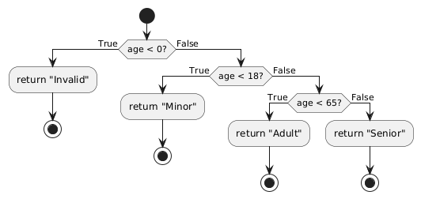

# 1. Introduction

White box testing involves looking at the **internal structure** of your code. Instead of just feeding inputs and observing outputs (as in black box testing), you design tests to ensure that **every line, branch, and condition** in your code is exercised. This approach can catch subtle logic errors and ensure thorough testing.

For demonstration, consider a **very simple function** that classifies a person’s age group:

```python
def categorize_age(age):
    if age < 0:
        return "Invalid"
    elif age < 18:
        return "Minor"
    elif age < 65:
        return "Adult"
    else:
        return "Senior"
```

This function:
1. Returns `"Invalid"` if the age is less than 0.
2. Returns `"Minor"` if the age is between 0 and 17 (inclusive).
3. Returns `"Adult"` if the age is between 18 and 64 (inclusive).
4. Returns `"Senior"` if the age is 65 or older.

We’ll use this function to illustrate each testing concept.

---

# 2. Control Flow Testing

## 2.1 What Is Control Flow Testing?
- **Control Flow Testing** focuses on the way your code’s execution paths (the “flow” of instructions) behave.
- You typically visualize or think about a **control flow graph**, where each **node** is a block of code, and each **edge** represents a jump from one block to another (e.g., after an `if` statement, you can go to the `then` block or the `else` block).

## 2.2 Applying Control Flow Testing to `categorize_age`
1. **Identify Decision Points**  
   - In `categorize_age`, each `if` or `elif` is a **decision point**.  
     - `if age < 0`  
     - `elif age < 18`  
     - `elif age < 65`  
     - (the final `else` is also a branch)
    
**Control Flow Graph**




2. **Design Test Cases**  
   - You want to ensure that you cover each of these paths.  
   - For instance:
     - **Test case 1**: `age = -1` → covers `if age < 0` returning `"Invalid"`.
     - **Test case 2**: `age = 10` → covers `elif age < 18` returning `"Minor"`.
     - **Test case 3**: `age = 40` → covers `elif age < 65` returning `"Adult"`.
     - **Test case 4**: `age = 70` → covers the `else` branch returning `"Senior"`.

3. **Goal**  
   - Ensure **each control flow branch** is executed at least once.  
   - This directly leads us to **branch coverage** (discussed further below), but from a higher-level perspective, you’re verifying the flow of logic from start to end.

---

# 3. Data Flow Testing
Below is an **augmented version** of the Data Flow Testing notes, **expanded** to clarify how Data Flow Testing differs from Control Flow Testing, the types of anomalies it can catch, and how it might apply in larger Python projects.

---

## 3.1 What Is Data Flow Testing?

1. **Definition**  
   - **Data Flow Testing** tracks how data (variables) **enter**, are **manipulated**, and ultimately **exit** or become **“dead”** in the code.  
   - It focuses on the **life cycle** of each variable:  
     1. **Definition** – Where the variable is first assigned.  
     2. **Usage** – Where the variable is read or updated.  
     3. **Kill** – Where the variable goes out of scope or is overwritten.

2. **Primary Goals**  
   - Identify **anomalies** such as:
     - **Using a variable before it’s defined** (uninitialized use).  
     - **Redefining a variable without using it** (the original value is “lost” without ever being read).  
     - **Variables that are never used** (dead code or wasted computation).

3. **How It Differs from Control Flow Testing**  
   - **Control Flow Testing** is about **branches** (e.g., `if/else`, loops) and ensuring every **decision path** is executed at least once.  
   - **Data Flow Testing** is about **how variables move** through those paths—making sure variables are **properly defined** before use, not redefined prematurely, and not left unused.  
   - In essence, **control flow** targets the *logic structure*, while **data flow** targets the *variable usage patterns*.

4. **Where Data Flow Testing Is Critical**  
   - In large or complex Python codebases where variables flow across multiple functions, classes, or modules.  
   - In situations where you have many **shared variables**, or **state** is maintained (e.g., in object attributes, global variables, or session state in web apps).

---

## 3.2 Applying Data Flow Testing to `categorize_age`

Consider the following simple function in Python:

```python
def categorize_age(age):
    if age < 0:
        return "Invalid"
    elif age < 18:
        return "Minor"
    elif age < 65:
        return "Adult"
    else:
        return "Senior"
```

1. **In Python, Variables Are Often “Defined on the Fly”**  
   - The parameter `age` is introduced as soon as the function is called. There’s no separate “declaration” line as in some other languages.

2. **Checking Data Flow for `age`**  
   - **Definition**: `age` is defined when the function receives its parameter.  
   - **Usage**: `age` is used in three comparisons (`age < 0`, `age < 18`, `age < 65`).  
   - **No Redefinitions**: We never reassign `age` inside this function.  
   - **No Unused Variables**: We don’t define additional variables that remain unused.  

3. **Identifying Potential Anomalies**  
   - **Using a variable before it’s defined**: Not an issue here, because `age` is always defined as a function argument.  
   - **Redefining a variable without using it**: Doesn’t apply, as `age` is never redefined.  
   - **Never used**: No extra variable is defined and left unused.

4. **Why Data Flow Testing Doesn’t Reveal Big Issues Here**  
   - Because this function is straightforward and short, with only one variable (`age`).  
   - In bigger codebases, you might have multiple variables passed between functions or classes, where the chance of **“use before definition”** or **“unnecessary redefinition”** is higher.

5. **Example of a Subtle Data Flow Bug (Hypothetical)**  
   ```python
   def categorize_age_and_update_record(age, record):
       # Suppose 'record' is expected to have 'value' updated,
       # but we forgot to define or initialize 'value' somewhere else.
       if 'value' not in record:
           # We never define record['value'] here...
           pass

       if age < 0:
           return "Invalid"
       record['value'] = age  # Potentially overwriting something not initialized?
       return "Updated"
   ```
   - A **data flow** review might show that `record['value']` is referenced without any proper definition in some flows (especially if we conditionally skip setting it).  
   - This can lead to unexpected behavior or errors in real code, especially if you rely on `'value'` being set before use.

---

## 3.3 Combining Data Flow & Control Flow Testing

1. **Control Flow**  
   - You’d ensure that every **branch** (`if age < 0`, `elif age < 18`, etc.) is tested.  
   - Example test inputs: -1, 10, 40, 70.

2. **Data Flow**  
   - You’d ensure `age` (and any other variables) are **defined** and **used** in all relevant code paths.  
   - Example checks: Does a certain path use a variable incorrectly? Is there any path where a variable remains undefined?

By **combining** both approaches, you verify:
- **All logic paths** are covered, and  
- **All variable usages** are correct.

---

# 4. Statement Coverage

## 4.1 What Is Statement Coverage?
- **Statement Coverage** measures the **percentage of executable lines** in your code that have been run at least once by your tests.
- If your code has 100 lines, and your tests only execute 80 of those lines, you have **80% statement coverage**.

## 4.2 Applying Statement Coverage to `categorize_age`
- The function has the following statements:
  1. `def categorize_age(age):`
  2. `if age < 0:`
  3. `return "Invalid"`
  4. `elif age < 18:`
  5. `return "Minor"`
  6. `elif age < 65:`
  7. `return "Adult"`
  8. `else:`
  9. `return "Senior"`

- With the **four test cases** mentioned earlier (`-1`, `10`, `40`, `70`), we ensure:
  - The `return "Invalid"` line (statement #3) is executed.
  - The `return "Minor"` line (statement #5) is executed.
  - The `return "Adult"` line (statement #7) is executed.
  - The `return "Senior"` line (statement #9) is executed.

- Thus, **all statements** are executed across the full set of tests. We achieve **100% statement coverage**.

---

# 5. Branch Coverage (Decision Coverage)

## 5.1 What Is Branch Coverage?
- **Branch Coverage** (also called Decision Coverage) ensures that **each branch of a decision** (e.g., `if` or `while`) **is executed at least once**.
- If you have a simple `if x > 0`, you need:
  - a test where `x > 0` is **true**  
  - a test where `x > 0` is **false**

## 5.2 Applying Branch Coverage to `categorize_age`
- Our function has multiple branches:
  1. `if age < 0`
  2. `elif age < 18`
  3. `elif age < 65`
  4. `else`
- Each `if`/`elif`/`else` is effectively a **branch**.  
- By having test inputs that lead to each of these outcomes, we ensure each branch is **taken**.
  - `age = -1` → branch #1
  - `age = 10` → branch #2
  - `age = 40` → branch #3
  - `age = 70` → branch #4
- With these tests, we **cover all branches**. Again, we end up with **100% branch coverage**.

> **Note**: Branch coverage goes **one level deeper** than statement coverage. You might have 100% statement coverage but **not** 100% branch coverage if, for instance, you only tested the `true` side of an `if` condition and never tested the `false` side.

---

# 6. Condition Coverage

## 6.1 What Is Condition Coverage?
- **Condition Coverage** ensures that **each Boolean sub-expression** within a decision is evaluated to **both true and false** at least once.
- Condition coverage is more granular than branch coverage if you have **complex** conditions (e.g., `if (x > 0 and y < 10)`).

## 6.2 Applying Condition Coverage to `categorize_age`
- In our simple function, each condition is a single comparison:  
  - `age < 0`  
  - `age < 18`  
  - `age < 65`
- Each condition is tested for **true** and **false**. For instance:
  - `age < 0`: 
    - True for `-1`,  
    - False for any age ≥ 0 (e.g., 10).
  - `age < 18`:
    - True for 10,  
    - False for 20, 40, 70.
  - `age < 65`:
    - True for 40,  
    - False for 70.

Because we covered each condition’s true/false scenario, we have full condition coverage. However, note that in more complex code (like `if age < 18 and region == 'US'`), you’d need separate tests to make `age < 18` both true and false, and `region == 'US'` both true and false, ensuring all sub-conditions are tested thoroughly.

---

# 7. Path Coverage

## 7.1 What Is Path Coverage?
- **Path Coverage** aims to test **every possible route** through the code, considering **all combinations** of branches.
- In larger functions with multiple nested conditions or loops, **path coverage** can become very large or even **impractical** due to the number of possible paths.

## 7.2 Applying Path Coverage to `categorize_age`
- In this example, each input follows exactly one path (one of the `if` / `elif` / `elif` / `else`).  
- The code is a **simple chain** of conditions, so there are effectively **four possible paths**:
  1. `age < 0` → return "Invalid"
  2. `age >= 0` and `age < 18` → return "Minor"
  3. `age >= 18` and `age < 65` → return "Adult"
  4. `age >= 65` → return "Senior"
- Our **four test cases** also cover **all four** paths. Hence, we achieve **100% path coverage**.

> **In More Complex Functions**  
> If you have nested conditions (e.g., `if x > 0:` then inside that block another `if y > 10:`), the number of paths multiplies. You’d need to consider each combination to achieve **full path coverage**.

---

# 8. Cyclomatic Complexity

## 8.1 What Is Cyclomatic Complexity?
- **Cyclomatic Complexity** is a metric that tells you the **number of independent paths** through your code.  
- Calculated by the formula:  
  \[
    M = E - N + 2
  \]  
  where:
  - \( E \) = number of **edges** in the control flow graph  
  - \( N \) = number of **nodes** in the control flow graph  
  - \( M \) = Cyclomatic Complexity

## 8.2 Interpreting Cyclomatic Complexity
- A **lower complexity** (1, 2, 3) means the code is simpler with fewer branches.  
- A **higher complexity** might indicate your code is more difficult to test and maintain. You may have many nested `if` statements or loops.

## 8.3 Example Calculation for `categorize_age`
While we often let automated tools measure it, we can do a **rough** estimation:

- Let’s label each node (executable block) and edges in our pseudo control flow graph:

  1. Start node -> **check `age < 0`** -> 2 possible edges (true / false).
  2. If true, go to “return `Invalid`” (end node).
  3. If false, check `age < 18` -> 2 possible edges (true / false).
  4. If true, go to “return `Minor`” (end node).
  5. If false, check `age < 65` -> 2 possible edges (true / false).
  6. If true, go to “return `Adult`” (end node).
  7. If false, go to “return `Senior`” (end node).

  Counting the edges (E) and nodes (N) precisely can vary based on how you break them down. But it’s typically around:
  - **N** ~ 8 or 9  
  - **E** ~ 8 or 9

  This function’s complexity is fairly **low**, likely **4** or so. Automated tools (like coverage analyzers) will give the exact number. For code with multiple nested conditions and loops, you might see a complexity of 10, 20, or more.

> **Implication**: The higher the Cyclomatic Complexity, the more test cases you’ll generally need to achieve **full path coverage**.

---

# 9. Putting It All Together: A Sample Test File

Below is a minimal example of how you might write a test file (`test_age.py`) to achieve **comprehensive coverage** of the `categorize_age` function using **pytest**:

```python
import pytest
from my_module import categorize_age

def test_categorize_age_invalid():
    assert categorize_age(-1) == "Invalid"

def test_categorize_age_minor():
    assert categorize_age(10) == "Minor"

def test_categorize_age_adult():
    assert categorize_age(40) == "Adult"

def test_categorize_age_senior():
    assert categorize_age(70) == "Senior"
```

- Running `pytest --cov=my_module --cov-report=term-missing` would likely show **100% statement coverage** and **100% branch coverage** for the `categorize_age` function.  
- With these tests, each **control flow** path is executed, each **condition** is tested both ways (true or false), and the **data flow** for the variable `age` is straightforward and correct.

---

# 10. Conclusion

By applying **white box testing** strategies to even a simple function, we can see:

1. **Control Flow Testing** ensures we’ve inspected how the code flows from one branch to another.  
2. **Data Flow Testing** helps confirm that variables are used properly.  
3. **Statement Coverage** verifies every line is run at least once.  
4. **Branch Coverage** ensures every `if`/`else` decision is taken in both directions.  
5. **Condition Coverage** digs deeper into each Boolean expression within a condition.  
6. **Path Coverage** seeks to cover every possible route through the code, which can balloon in complexity if you have nested logic.  
7. **Cyclomatic Complexity** helps us understand how many independent paths exist, guiding how many tests might be needed for thorough coverage.

For **novice students**, it’s **crucial** to understand these concepts as they are at the core of writing robust test suites. By starting with a small example, you gain the **foundational skills** to tackle more complex applications where multiple nested conditions, loops, and larger control flow graphs exist.
