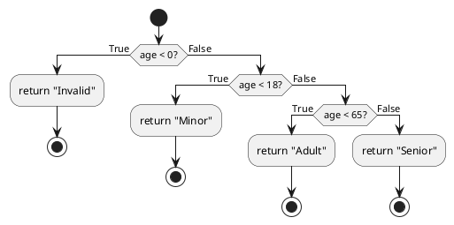

Below is a **PlantUML** diagram illustrating the **control flow graph** for the `categorize_age(age)` function. It shows each decision (`if`/`elif`/`else`) and the resulting path (return statements). You can copy this snippet into a [PlantUML editor](https://plantuml.com/try) to generate the actual diagram.

### Explanation of the Diagram
1. The diagram **starts** execution at the top.  
2. The first **if** checks `age < 0`.  
   - If **true**, it returns `"Invalid"` and **stops**.  
   - If **false**, it proceeds to the next condition.  
3. The second **if** checks `age < 18`.  
   - If **true**, it returns `"Minor"` and **stops**.  
   - If **false**, it proceeds further.  
4. The third **if** checks `age < 65`.  
   - If **true**, it returns `"Adult"` and **stops**.  
   - If **false**, it returns `"Senior"` and **stops**.  

This flowchart visually represents **all possible paths** in the function, highlighting each **decision point** and the corresponding **return**.
